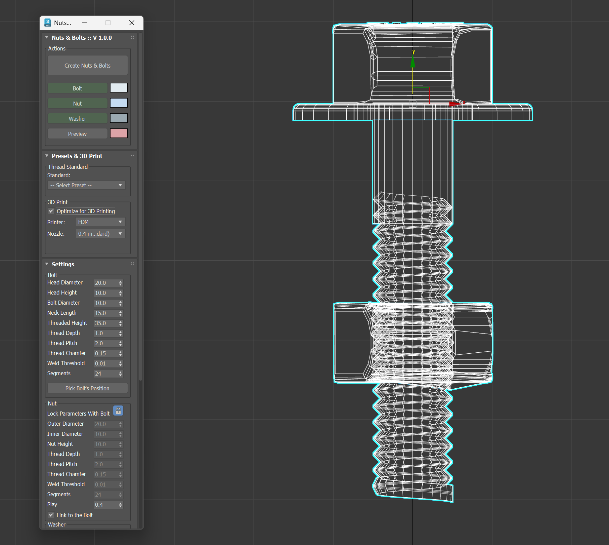

# Nuts & Bolts — 3ds Max Script v1.0.0

A free MaxScript for **Autodesk 3ds Max** that generates detailed, parametric nuts, bolts and washers in a single click — now with real-world thread standard presets and built-in 3D print optimisation.

---

## Features

| Category | Details |
|---|---|
| **One-click generation** | Creates bolt, nut and washer simultaneously |
| **Neck Length control** | Separate unthreaded shaft length (set to 0 for fully-threaded bolt) |
| **Tapered thread tip** | Thread depth ramps from 0 at the tip to full depth over the first revolution — no more Boolean saw-box hack |
| **Fixed nut thread** | Play baked directly into helix radii; Push modifier removed — eliminates warp/distortion artefacts |
| **Thread standard presets** | 28 presets: **ISO Metric Coarse** (M2–M24), **UNC** (#4-40 to 3/4-10), **UNF** (1/4-28 to 1/2-20), **BSW** (1/4″–1/2″) |
| **3D Print mode** | Auto-sets nut play gap: FDM 0.4 mm nozzle → 0.40 mm, FDM 0.2 mm nozzle → 0.25 mm, SLA → 0.15 mm |
| **Live preview** | Rough preview updates in real-time as you change settings |
| **Full bolt parameters** | Head diameter/height, neck length, threaded height, thread depth/pitch/chamfer, weld threshold, segments |
| **Full nut parameters** | Outer/inner diameter, height, thread depth/pitch/chamfer, weld threshold, segments, play |
| **Washer** | Outer/inner diameter, height, chamfer |
| **Text marking** | Extruded text on bolt head top |
| **Parenting** | Optionally link nut and washer to bolt |
| **Wire colours** | Independent colour pickers for bolt, nut, washer and preview |
| **Max compatibility** | 3ds Max 2016 – 2025 |

---

## Installation

1. Download `NutsAndBolts-032.ms` and the `nuts_doc/` folder — keep them in the same directory.
2. In 3ds Max, go to **MaxScript → Run Script** and select `NutsAndBolts-032.ms`.  
   Or drag the `.ms` file directly into the 3ds Max viewport.
3. The **Nuts & Bolts** floating panel will open.

No installation or plugin registration required.

---

## Quick Start

1. Open the **Presets & 3D Print** rollout and pick a thread standard (e.g. *M6*) — all parameters fill in automatically.
2. Optionally enable **Optimize for 3D Printing** and choose your printer type and nozzle size.
3. Click **Create Nuts & Bolts**.

That's it. For more control:

- Use the **Preview** toggle to see a rough blockout before generating the final mesh.
- Adjust any parameter in the **Settings** rollout — the lock button keeps the nut parameters in sync with the bolt.
- Use **Pick Bolt's Position** to place the bolt at any scene object's position.

---

## UI Overview

### Actions Rollout
- **Create Nuts & Bolts** — generates all enabled parts using current settings.
- **Bolt / Nut / Washer** toggle buttons — enable or disable each part.
- **Preview** — shows a low-poly blockout that updates live.
- Colour swatches — assign wire colours per part.

### Presets & 3D Print Rollout
- **Thread Standard** dropdown — selects from 28 industry-standard thread profiles and fills all bolt/nut parameters.
- **Optimize for 3D Printing** checkbox — unlocks printer type and nozzle selector, and auto-sets the nut *Play* gap.

### Settings Rollout — Bolt
| Parameter | Description |
|---|---|
| Head Diameter | Hex head, corner-to-corner dimension |
| Head Height | Thickness of the flat hex head |
| Bolt Diameter | Outer diameter of the threaded shaft |
| Neck Length | Unthreaded shaft length below head (0 = fully threaded) |
| Threaded Height | Length of the threaded section |
| Thread Depth | Radial depth of each thread cut |
| Thread Pitch | Peak-to-peak thread spacing |
| Thread Chamfer | Chamfer on outer thread edge |
| Weld Threshold | Merge distance for helix weld — increase if you see gaps |
| Segments | Radial divisions (snapped to exact divisor of 360) |

### Settings Rollout — Nut
Same thread parameters as the bolt, plus:

| Parameter | Description |
|---|---|
| Outer Diameter | Hex outer dimension (corner-to-corner) |
| Inner Diameter | Bore diameter |
| Play | Radial gap added to nut thread so bolt slides freely; critical for 3D print fit |
| Lock button | Syncs nut parameters to bolt for guaranteed match |

---

## Thread Standard Reference

| Family | Sizes included |
|---|---|
| ISO Metric Coarse | M2, M2.5, M3, M4, M5, M6, M8, M10, M12, M16, M20, M24 |
| UNC | #4-40, #6-32, #8-32, #10-24, 1/4-20, 5/16-18, 3/8-16, 1/2-13, 3/4-10 |
| UNF | 1/4-28, 5/16-24, 3/8-24, 1/2-20 |
| BSW (55°) | 1/4″, 3/8″, 1/2″ |

All dimensions are in **millimetres** and match ISO 4017 / ISO 4032 (hex bolt / hex nut) specifications. Head and nut outer diameters are the circumscribed (across-corners) values.

---

## 3D Printing Guide

| Printer | Nozzle | Recommended Play |
|---|---|---|
| FDM | 0.4 mm (standard) | **0.40 mm** — accounts for layer squish and bead spread |
| FDM | 0.2 mm (fine) | **0.25 mm** — less bead spread but still some shrinkage |
| SLA / MSLA | — | **0.15 mm** — high accuracy, minimal gap needed |

Enable **Optimize for 3D Printing** in the *Presets & 3D Print* rollout to apply these values automatically. You can always fine-tune the *Play* spinner in Settings.

---

## Changelog

### v1.0.0 — March 2026
- **Neck Length** — dedicated spinner replaces the old "Bolt Height" which combined neck and thread.
- **Tapered thread tip** — helix taper computed analytically; removed unreliable `boolObj` Boolean + `bevelFaces` approach.
- **Nut thread fix** — removed `Push` modifier from nut thread cutter; play is now offset via radii, eliminating mesh distortion.
- **Thread presets** — 28 standards across ISO, UNC, UNF and BSW.
- **3D Print pane** — FDM/SLA printer selector with nozzle-aware play values.
- **Max 2025 compatibility** — updated face-index convention; deprecated API calls removed.

### v0.3.2 — May 2018 (original by Oormi Creations)
- Spiral threads, many new parameters, live preview.

---

## License

Free for any commercial or non-commercial use and modification. The script is provided as-is with no warranty.  
Original script © Oormi Creations 2018. Updates © 2026.
